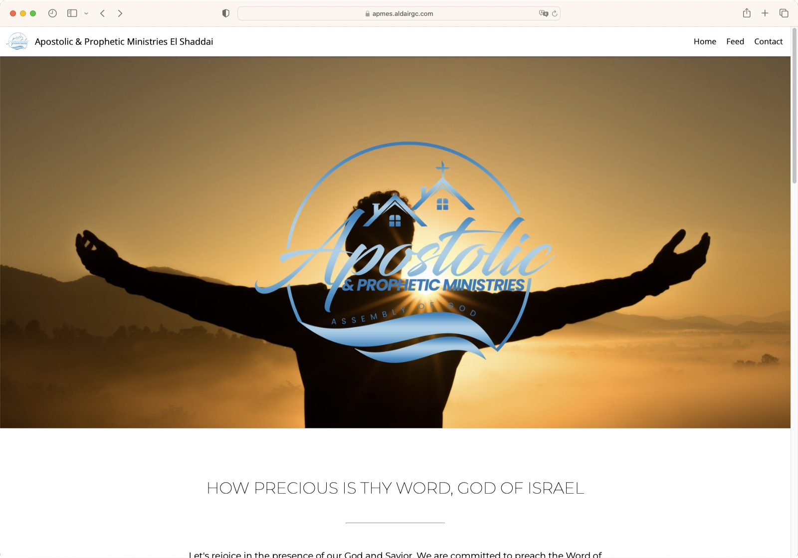
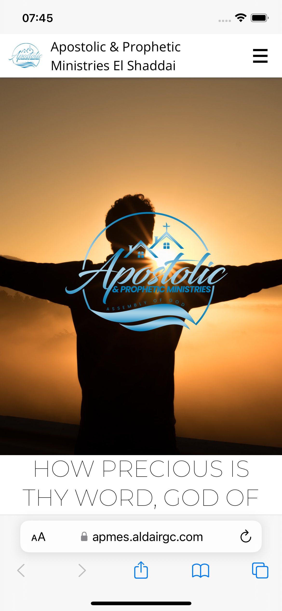

# <div align="center">APMES</div>

## Description

The project `APMES`, which stands for Apostolic and Prophetic Ministries El Shaddai is a single-page web application written using Vite and React with Typescript.
It's an introduction to the El Shaddai Ministry feeded with news, pictures, videos, requests from visitors, agenda, contact information and also location on the map.
It's compatible with desktop and mobile devices.

## Getting Started

The following is recommended for the development environment:

1. Usage of [Visual Studio Code](https://code.visualstudio.com/) as IDE and the following plugins:
   - Prettier - Code formatter
   - ESLint
2. [Node.js](https://nodejs.org/en/download/)
3. [NPM](https://www.npmjs.com/)
4. [GIT](https://git-scm.com/)

## Technologies

<ul>
  <li><a href="https://nodejs.org/en/">Node.Js</a></li>
  <li><a href="https://www.typescriptlang.org/">Typescript</a></li>
  <li><a href="https://vitejs.dev/">Vite</a></li>
  <li><a href="https://reactjs.org/">React JS</a></li>
  <li><a href="https://redux-toolkit.js.org/">Redux Toolkit</a></li>
  <li><a href="https://www.npmjs.com/package/axios">Axios</a></li>
  <li><a href="https://react-icons.github.io/react-icons/">React-icons</a></li>
  <li><a href="https://react-redux.js.org/">React-redux</a></li>
  <li><a href="https://www.npmjs.com/package/redux-persist">Redux-persist</a></li>
  <li><a href="https://styled-components.com/">Styled-components</a></li>
  <li><a href="https://www.npmjs.com/package/validator">Validator</a></li>
  <li><a href="https://www.npmjs.com/package/heic2any">Heic2any</a></li>
</ul>

## Folder Structure

```
./apmes-frontend/
 ├── src                 - react code
   ├── app               - settings files
   ├── assets            - images files
   ├── components        - all reusable components structured in subfolders
   ├── pages             - all pages structured in subfolders
   ├── routes            - router tree settings
   ├── services          - services for external access
 ├── .editorconfig       - editorconfig configutation file
 ├── .eslintrc.cjs       - eslint configuration file
 ├── .gitignore          - ignore settings from git
 ├── .prettierrc.cjs     - prettier configuration file
 ├── index.html          - project's index file
 ├── package-lock.json   - npm configuration file
 ├── package.json        - npm configuration file
 ├── tsconfig.json       - typescript configuration file
 ├── tsconfig.node.json  - typescript configuration file
 ├── vite.config.ts      - vite configuration file
 └── README.md           - content of this file
```

## Notes

This is the front-end part of the project. The back-end must be running in a server for it to work.

Backend repo: <a href="https://github.com/aldair-gc/apmelshaddai-backend.git">https://github.com/aldair-gc/apmelshaddai-backend.git</a>

## Run

```
$ git clone https://github.com/aldair-gc/apmelshaddai-frontend.git
$ npm install
$ npm run dev
```

Open in the browser http://localhost:5173

## Status

Ready.

## Features

- [x] Authentication
- [x] Management
- [x] User Access
- [x] Post CRUD
- [x] Group CRUD
- [ ] Recover user's forgotten password

## Demo

<h1 align="center">
  
</h1>
<h1 align="center">
  
</h1>
